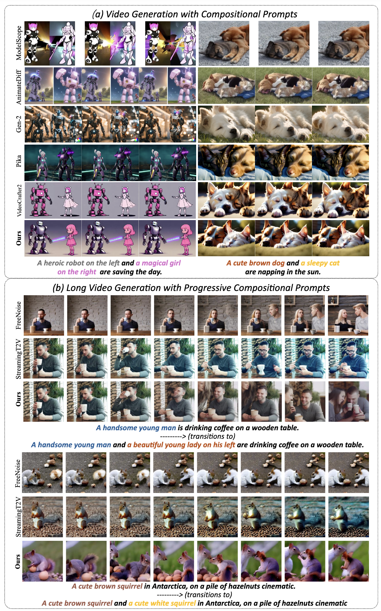
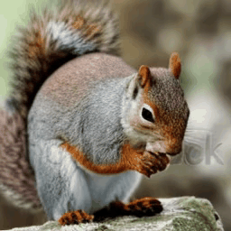

## ___***VideoTetris: Towards Compositional Text-To-Video Generation***___
<div align="left">
 <a href=''></a> &nbsp;&nbsp;&nbsp;&nbsp;&nbsp;
 <a href='https://videotetris.github.io'></a> &nbsp;&nbsp;&nbsp;&nbsp;&nbsp;

This repo contains the official implementation of our [VideoTetris]().

> [**VideoTetris: Towards Compositional Text-To-Video Generation**]()   
> [Ye Tian*](https://scholar.google.com/citations?user=vUY_PIUAAAAJ&hl=en),
> [Ling Yang*$\dagger$](https://yangling0818.github.io), 
> [Haotian Yang](https://scholar.google.com/citations?user=LH71RGkAAAAJ&hl=en),
> [Yuan Gao](https://videotetris.github.io/),
> [Yufan Deng](https://videotetris.github.io/),
> [Jingmin Chen](https://videotetris.github.io/),
> [Xintao Wang](https://xinntao.github.io),
> [Zhaochen Yu](https://videotetris.github.io/),
> [Xin Tao](https://scholar.google.com/citations?user=sQ30WyUAAAAJ&hl=en),
> [Pengfei Wan](https://scholar.google.com/citations?user=P6MraaYAAAAJ&hl=en),
> [Di Zhang](https://openreview.net/profile?id=~Di_ZHANG3),
> [Bin Cui](https://cuibinpku.github.io/cuibin_cn.html)   
> (* Equal Contribution, $\dagger$ Corresponding Author)
> <br>Peking University, Kuaishou Technology<br>


## Introduction
VideoTetris is a novel framework that enables **compositional T2V generation**. Specifically, we propose **spatio-temporal compositional diffusion** to precisely follow complex textual semantics by manipulating and composing the attention maps of denoising networks spatially and temporally. Moreover, we propose an enhanced video data preprocessing to enhance the training data regarding motion dynamics and prompt understanding, equipped with a new reference frame attention mechanism to improve the consistency of auto-regressive video generation.  Our demonstrations include successful examples of **videos spanning from 10s, 30s to 2 minutes**, and can be extended for even longer durations.
<table class="center">
    <tr>
    <td width=80% style="border: none"></td>
    </tr>
    <tr>
    <td width="100%" style="border: none; text-align: center; word-wrap: break-word">
</td>
  </tr>
</table>


## News and Todo List
- [2024.6.7] Paper [VideoTetris]() released 
- [ ] Release the inference code of VideoTetris with VideoCrafter2
- [ ] Release the checkpoint of our long compositonal video generation
- [ ] Release VideoTetris with KLing/FIFO-Diffusion

## Training and Inference
(TODO)

## Example Results
We only provide some example results here, more detailed results can be found in the [project page](https://videotetris.github.io/).
<table class="center">
    <tr>
    <td width=25% style="border: none"></td>
    <td width=25% style="border: none"></td>
  <tr>
    <td width="25%" style="border: none; text-align: center; word-wrap: break-word">A cute brown dog on the left and a sleepy cat on the right are napping in the sun. <br> @16 Frames</td>
    <td width="25%" style="border: none; text-align: center; word-wrap: break-word">A cheerful farmer and a hardworking blacksmith are building a barn. <br> @16 Frames</td>
  </tr>
</table>

<table class="center">
    <tr>
    <td width=25% style="border: none"></td>
    <td width=25% style="border: none"></td>
  <tr>
    <td width="25%" style="border: none; text-align: center; word-wrap: break-word">One cute brown squirrel, on a pile of hazelnuts, cinematic. <br> ------>  transitions to <br>
Two cute brown squirrels, on a pile of hazelnuts, cinematic. <br> ------>  transitions to <br>
Three cute brown squirrels, on a pile of hazelnuts, cinematic. <br> ------>  transitions to <br>
Four cute brown squirrels, on a pile of hazelnuts, cinematic. <br> 
 @80 Frames</td>
    <td width="25%" style="border: none; text-align: center; word-wrap: break-word">A cute brown squirrel, on a pile of hazelnuts, cinematic. <br> ------>  transitions to <br>
A cute brown squirrel and a cute white squirrel, on a pile of hazelnuts, cinematic.  <br>
 @240 Frames</td>
  </tr>
</table>


## Citation
```
@article{tian2024videotetris,
  title={VideoTetris: Towards Compositional Text-to-Video Generation},
  author={Tian, Ye and Yang, Ling and Yang, Haotian and Gao, Yuan and Deng, Yufan and Chen, Jingmin and Wang, Xintao and Yu, Zhaochen and Tao, Xin and Wan, Pengfei and Zhang, Di and Cui, Bin},
  journal={arXiv preprint arXiv:2401.},
  year={2024}
}
```
