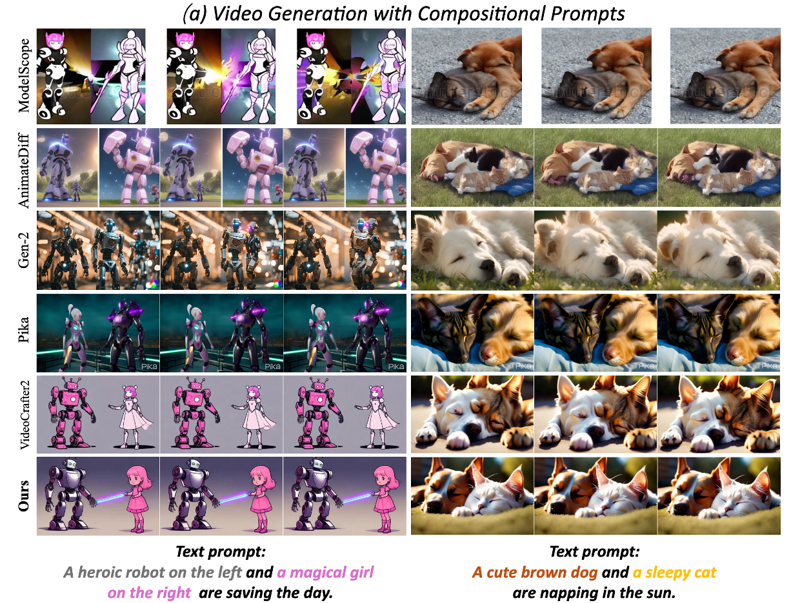
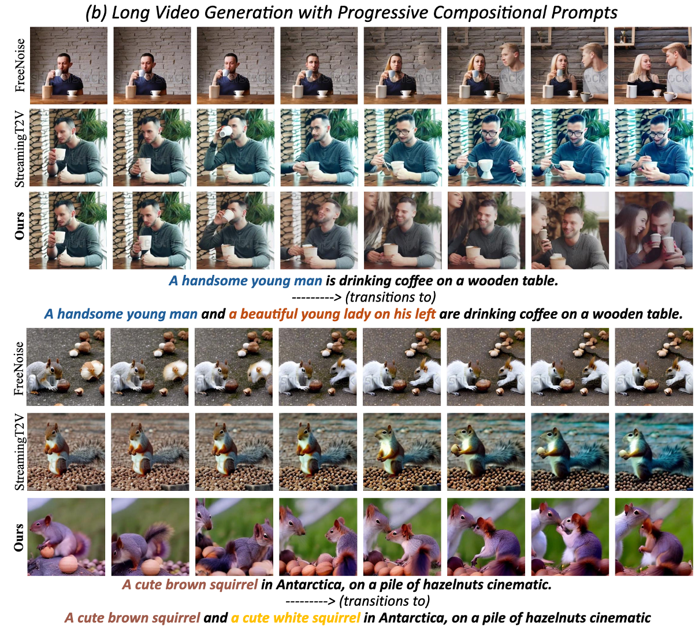

## ___***VideoTetris: Towards Compositional Text-To-Video Generation***___
<div align="left">
 <a href='https://arxiv.org/abs/2406.04277'></a> &nbsp;&nbsp;&nbsp;&nbsp;&nbsp;
 <a href='https://videotetris.github.io'></a> &nbsp;&nbsp;&nbsp;&nbsp;&nbsp;

This repo contains the official implementation of our [VideoTetris](https://arxiv.org/abs/2406.04277).

> [**VideoTetris: Towards Compositional Text-To-Video Generation**](https://arxiv.org/abs/2406.04277)   
> [Ye Tian](https://tyfeld.github.io/),
> [Ling Yang*](https://yangling0818.github.io), 
> [Haotian Yang](https://scholar.google.com/citations?user=LH71RGkAAAAJ&hl=en),
> [Yuan Gao](https://videotetris.github.io/),
> [Yufan Deng](https://videotetris.github.io/),
> [Jingmin Chen](https://videotetris.github.io/),
> [Xintao Wang](https://xinntao.github.io),
> [Zhaochen Yu](https://videotetris.github.io/),
> [Xin Tao](https://scholar.google.com/citations?user=sQ30WyUAAAAJ&hl=en),
> [Pengfei Wan](https://scholar.google.com/citations?user=P6MraaYAAAAJ&hl=en),
> [Di Zhang](https://openreview.net/profile?id=~Di_ZHANG3),
> [Bin Cui](https://cuibinpku.github.io/cuibin_cn.html)   
> (* Equal Contribution and Corresponding Author)
> <br>Peking University, Kuaishou Technology<br>

## News Update
- [x] Paper [VideoTetris](https://arxiv.org/abs/2406.04277) released 
- [x] Release the inference code for compositioanl video generation based on VideoCrafter2
- [x] Release our finetuned StreamingT2V for long video generation based on our filtered dataset
- [ ] Release the code for our LLM spatio-temporal planning
- [ ] Release the training/inference code of our long compositional video generation 
- [ ] Release the checkpoint of our long compositional video generation 

## Introduction
VideoTetris is a novel framework that enables **compositional T2V generation**. Specifically, we propose **spatio-temporal compositional diffusion** to precisely follow complex textual semantics by manipulating and composing the attention maps of denoising networks spatially and temporally. Moreover, we propose an enhanced video data preprocessing to enhance the training data regarding motion dynamics and prompt understanding, equipped with a new reference frame attention mechanism to improve the consistency of auto-regressive video generation.  Our demonstrations include successful examples of **videos spanning from 10s, 30s to 2 minutes**, and can be extended for even longer durations.
<table class="center">
    <tr>
    <td width=100% style="border: none"></td>
    </tr>
    <tr>
    <td width="100%" style="border: none; text-align: center; word-wrap: break-word">
</td>
  </tr>
    <tr>
    <td width=100% style="border: none"></td>
    </tr>
    <tr>
    <td width="100%" style="border: none; text-align: center; word-wrap: break-word">
</td>
  </tr>
</table>


## Training and Inference

### Composition Video Generation
We provide the inference code for compositional video generation based on VideoCrafter2. You can download the pretrained model from [Hugging Face](https://huggingface.co/VideoCrafter/VideoCrafter2/blob/main/model.ckpt) and put it in `checkpoints/base_512_v2/model.ckpt`. Then run the following command:
#### 1. Install Environment via Anaconda (Recommended)
```bash
conda create -n videocrafter python=3.8.5
conda activate videocrafter
pip install -r requirements.txt
```

#### 2. Region Planning
You can then plan the regions for different sub-objects in a json file like `prompts/demo_videotetris.json`. The regions are defined by the top-left and bottom-right coordinates of the bounding box. You can refer to the `prompts/demo_videotetris.json` for an example. And the final planning json should be like:
```json
{
  {
    "basic_prompt": "A cat on the left and a dog on the right are napping in the sun.",
    "sub_objects":[
        "A cute orange cat.",
        "A cute dog."
    ],
    "layout_boxes":[
        [0, 0, 0.5, 1],
        [0.5, 0, 1, 1]
    ]
  },
}
```
In this case, we first define the basic prompt, and then specify the sub-objects and their corresponding regions, resulting in a video with a left cat and a right dog.

#### 3. Inference
```bash
sh scripts/run_text2video_from_layout.sh
```
You can specify the input json file `run_text2video_from_layout.sh` script.


### Long Video Generation with High Dynamics and Consistency

**We release a high-quality finetuned version of StreamingT2V for long video generation with our filtered dataset. You can download the weights from [Hugging Face-VideoTetris-long](https://huggingface.co/tyfeld/VideoTetris-long). Color degration no long exists and motion dynamics highly improved!**

To generate better long video, you can first setup the original [StreamingT2V](https://github.com/Picsart-AI-Research/StreamingT2V) environment follow the steps in its github repo. Then directly replace the 'streamingt2v.ckpt' in the [StreamingT2V](https://github.com/Picsart-AI-Research/StreamingT2V) codebase with the downloaded checkpoint. And inference any long video generation task with the original StreamingT2V codebase.

We are **still working on training a better long compositional video generation model in the VideoTetris framework**, and will release the training/inference code once it is ready. Stay tuned!


## Example Results
We only provide some example results here, more detailed results can be found in the [project page](https://videotetris.github.io/).
<table class="center">
    <tr>
    <td width=25% style="border: none"></td>
    <td width=25% style="border: none"></td>
  <tr>
    <td width="25%" style="border: none; text-align: center; word-wrap: break-word">A cute brown dog on the left and a sleepy cat on the right are napping in the sun. <br> @16 Frames</td>
    <td width="25%" style="border: none; text-align: center; word-wrap: break-word">A cheerful farmer and a hardworking blacksmith are building a barn. <br> @16 Frames</td>
  </tr>
</table>

<table class="center">
    <tr>
    <td width=35% style="border: none"></td>
    <td width=35% style="border: none"></td>
  <tr>
    <td width="35%" style="border: none; text-align: center; word-wrap: break-word">One cute brown squirrel, on a pile of hazelnuts, cinematic. <br> ------>  transitions to <br>
Two cute brown squirrels, on a pile of hazelnuts, cinematic. <br> ------>  transitions to <br>
Three cute brown squirrels, on a pile of hazelnuts, cinematic. <br> ------>  transitions to <br>
Four cute brown squirrels, on a pile of hazelnuts, cinematic. <br> 
 @80 Frames</td>
    <td width="35%" style="border: none; text-align: center; word-wrap: break-word">A cute brown squirrel, on a pile of hazelnuts, cinematic. <br> ------>  transitions to <br>
A cute brown squirrel and a cute white squirrel, on a pile of hazelnuts, cinematic.  <br>
 @240 Frames</td>
  </tr>
</table>


## Citation
```
@article{tian2024videotetris,
  title={VideoTetris: Towards Compositional Text-to-Video Generation},
  author={Tian, Ye and Yang, Ling and Yang, Haotian and Gao, Yuan and Deng, Yufan and Chen, Jingmin and Wang, Xintao and Yu, Zhaochen and Tao, Xin and Wan, Pengfei and Zhang, Di and Cui, Bin},
  journal={arXiv preprint arXiv:2406.04277},
  year={2024}
}
```

## Acknowledgements
